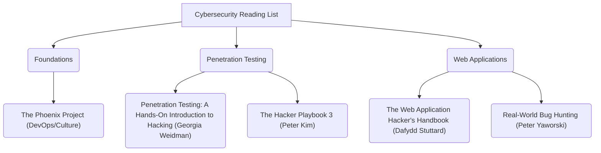

# Awesome Ethical Hacking Tutorials & Resources

<p align="center">
  
  
  
  
</p>

Welcome to the ultimate curated collection of ethical hacking tutorials, reference manuals, learning paths, interactive labs, and cybersecurity cheat sheets. This repository is designed to take you from a complete beginner to an advanced penetration tester or security researcher.

> [!WARNING]
> **Disclaimer:** This repository and the resources listed herein are intended solely for educational, research, and authorized testing purposes. Performing security assessments or scanning networks without prior explicit consent is illegal. Use these resources responsibly and ethically.

---

## Table of Contents

* [1. Guided Learning Paths](#1-guided-learning-paths)
  * [Phase 1: Foundations (Beginner)](#phase-1-foundations-beginner)
  * [Phase 2: Core Penetration Testing (Intermediate)](#phase-2-core-penetration-testing-intermediate)
  * [Phase 3: Specialized Security (Advanced)](#phase-3-specialized-security-advanced)
* [2. Tutorials & Video Courses](#2-tutorials--video-courses)
* [3. Hands-on Practice Labs & CTFs](#3-hands-on-practice-labs--ctfs)
* [4. Must-Read Books & Publications](#4-must-read-books--publications)
* [5. Ultimate Security Cheat Sheets](#5-ultimate-security-cheat-sheets)
* [6. Blogs, Podcasts & Newsletters](#6-blogs-podcasts--newsletters)
* [7. How to Contribute](#7-how-to-contribute)

---

## 1. Guided Learning Paths

Following a structured learning path is essential for mastering cybersecurity. Below is a recommended roadmap depending on your current level.

### Phase 1: Foundations (Beginner)
* **Goal:** Master networking concepts, operating systems (Linux & Windows command line), and scripting.
* **Topics to Cover:** TCP/IP model, routing, DNS, basic Bash/PowerShell commands, Python basics.
* **Recommended Start:**
  * Read through the [Linux Journey](https://linuxjourney.com/) tutorials.
  * Complete the **Pre-Security Path** on [TryHackMe](https://tryhackme.com/).

### Phase 2: Core Penetration Testing (Intermediate)
* **Goal:** Understand web vulnerabilities, network attacks, and standard exploitation methodologies.
* **Topics to Cover:** OWASP Top 10, network scanning (Nmap), Metasploit, privilege escalation basics.
* **Recommended Start:**
  * Complete [PortSwigger Web Security Academy](https://portswigger.net/web-security) for web hacking.
  * Work through the **Junior Penetration Tester** path on TryHackMe.
  * Solve the **OverTheWire Bandit** wargame to master SSH and command-line parsing.

### Phase 3: Specialized Security (Advanced)
* **Goal:** Dive deep into Active Directory (AD) exploitation, binary analysis, custom exploit development, and cloud security.
* **Topics to Cover:** Kerberoasting, buffer overflows, reverse engineering with Ghidra, AWS/Azure pentesting.
* **Recommended Start:**
  * Take the **Active Directory Hacking** tutorials by [TCM Security](https://tcm-sec.com/).
  * Tackle [Hack The Box (HTB)](https://www.hackthebox.com/) active machines.

---

## 2. Tutorials & Video Courses

A selection of the highest-rated free and premium video guides and interactive tutorials for ethical hacking.

| Course/Tutorial Name | Provider | Cost | Level | Link |
| :--- | :--- | :--- | :--- | :--- |
| **Practical Ethical Hacking** | TCM Security (Heath Adams) | Paid (Affordable) | Beginner-Intermediate | [Visit Course](https://academy.tcm-sec.com/p/practical-ethical-hacking-the-complete-course) |
| **Web Security Academy** | PortSwigger | **Free** | Beginner-Advanced | [Visit Academy](https://portswigger.net/web-security) |
| **Ethical Hacking Course (15 Hours)** | freeCodeCamp (Cyber-Insecurity) | **Free** | Beginner | [Watch on YouTube](https://www.youtube.com/watch?v=3Kq1MIfTWCE) |
| **Introduction to IT & Cybersecurity** | Cybrary | **Free** / Paid | Beginner | [Visit Cybrary](https://www.cybrary.it/course/introduction-to-it-and-cybersecurity) |
| **SANS Cyber Aces Online** | SANS Institute | **Free** | Beginner | [Visit SANS](http://www.cyberaces.org/) |

---

## 3. Hands-on Practice Labs & CTFs

Hacking is a practical skill. You must get your hands dirty in legal wargames and sandboxes.

*   **[TryHackMe](https://tryhackme.com/)** - *Best for Beginners.* Gamified, bite-sized rooms with guided instructions covering everything from Linux to Active Directory.
*   **[Hack The Box](https://www.hackthebox.com/)** - *Best for Intermediate/Advanced.* Emulates real-world networks. Requires independent research to compromise virtual machines.
*   **[OverTheWire](https://overthewire.org/wargames/)** - *Best Command-line Training.* Text-based wargames starting with Bandit, helping you learn Linux commands and cybersecurity concepts.
*   **[PortSwigger Academy Labs](https://portswigger.net/web-security/all-labs)** - *Best for Web Hacking.* Hundreds of interactive labs covering SQL injection, XSS, CSRF, SSRF, and API vulnerability exploitation.
*   **[VulnHub](https://www.vulnhub.com/)** - *Offline VM practice.* Downloadable virtual machines containing pre-configured vulnerabilities for local training.
*   **[CTFtime](https://ctftime.org/)** - *Capture The Flag Tracker.* The main directory for tracking global competitive hacking (CTF) events.

---

## 4. Must-Read Books & Publications

Great books provide the deep conceptual frameworks that quick tutorials sometimes miss.



*   **The Web Application Hacker's Handbook** *by Dafydd Stuttard & Marcus Pinto*
    *   *The definitive guide to finding and exploiting web vulnerabilities.*
*   **Penetration Testing: A Hands-On Introduction to Hacking** *by Georgia Weidman*
    *   *Excellent step-by-step introduction to setting up a lab and hacking networks/machines.*
*   **The Hacker Playbook 3: Practical Guide to Penetration Testing** *by Peter Kim*
    *   *Provides red team strategies, tools, and methodologies for advanced testers.*
*   **Real-World Bug Hunting: A Field Guide to Web Hacking** *by Peter Yaworski*
    *   *Analyzes real bug reports to explain how bug hunters earn bounties.*
*   **RTFM: Red Team Field Manual** *by Ben Clark*
    *   *A pocket-sized reference book containing essential commands and syntax.*

---

## 5. Ultimate Security Cheat Sheets

Quick reference guides for commands and syntax during assessments.

> [!TIP]
> Keep these open on your second monitor during CTFs and exams!

*   **[PayloadsAllTheThings](https://github.com/swisskyrepo/PayloadsAllTheThings)** - An enormous repository of payloads and bypasses for Web Application Security.
*   **[GTFOBins](https://gtfobins.github.io/)** - A curated list of Unix binaries that can be exploited to bypass local security restrictions and escalate privileges.
*   **[LOLBAS](https://lolbas-project.github.io/)** - (Living Off The Land Binaries and Scripts) The Windows equivalent of GTFOBins for privilege escalation and evasion.
*   **[Nmap Cheat Sheet](https://sushant747.gitbooks.io/total-oscp-guide/content/nmap_cheat_sheet.html)** - Quick reference for scanning networks, OS detection, and NSE scripts.
*   **[Active Directory Attack Cheat Sheet](https://github.com/Orange-Cyberdefense/arsenal)** - Commands and techniques for compromising Active Directory environments.

---

## 6. Blogs, Podcasts & Newsletters

Stay up to date with the latest industry news, zero-days, and write-ups.

*   **[Darknet Diaries](https://darknetdiaries.com/)** *(Podcast)* - Incredible storytelling covering true stories of hackers, hacktivism, cyber warfare, and shadow operations.
*   **[TLDR Sec](https://tldrsec.com/)** *(Newsletter)* - A weekly newsletter summarizing the best security blog posts, tools, and research.
*   **[Krebs on Security](https://krebsonsecurity.com/)** *(Blog)* - In-depth investigative journalism focusing on global cybercrime syndicates and breaches.
*   **[Daniel Miessler - Unsupervised Learning](https://danielmiessler.com/)** *(Blog & Newsletter)* - Explores the intersection of security, technology, and society.
*   **[HackRead](https://www.hackread.com/)** *(News Portal)* - Real-time coverage of security breaches, malware campaigns, and hacking incidents.

---

## 7. How to Contribute

We welcome contributions from the community! To suggest new tutorials or update broken links:

1.  **Fork** this repository.
2.  Create a new branch (`git checkout -b feature/suggest-resource`).
3.  Add your resource using the markdown formatting guidelines:
    ```markdown
    *   **[Resource Name](URL)** - Short, objective description of what the resource covers.
    ```
4.  Commit your changes (`git commit -m 'Add new Linux buffer overflow tutorial'`).
5.  Push your branch (`git push origin feature/suggest-resource`).
6.  Open a **Pull Request** explaining why the resource is high quality and belongs in this list.