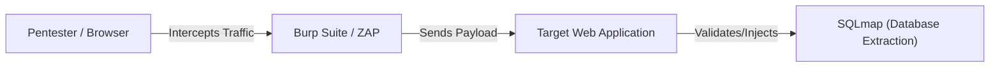

# Awesome Ethical Hacking Tools

  
  
  
  
  
  

---

  <h2>📱 Sponsored Mobile App</h2>
  <h3>Pro Hacker: Ethical Hacking</h3>
  
<b>Master Cybersecurity, Penetration Testing, and Hacking Foundations directly from your phone!</b>

  
  
  
  

    🚀 Developed by <b>GripxTech</b>, <b>Pro Hacker</b> is the ultimate interactive learning companion. Learn Kali Linux, web application hacking, network scanning, and Python scripting through structured lessons, real-world case studies, and gamified quizzes.
  

  
  <table>
    <tr>
      <td>📚 <b>Structured Courses</b></td>
      <td>🎮 <b>Interactive Quizzes</b></td>
      <td>🛡️ <b>Real-world Scenarios</b></td>
      <td>🐧 <b>Kali Linux Tutorials</b></td>
    </tr>
  </table>

---

A curated, comprehensive directory of awesome tools for ethical hacking, penetration testing, and security auditing. The tools are organized by the phase of standard penetration testing methodology and specialty domains.

> [!NOTE]
> Looking for guided learning roadmaps, video courses, books, and wargames? Check out our curated list: **[Awesome Hacking Tutorials & Resources](tutorials-and-resources.md)**!
> 
> ⚡ **Quick Access Custom Cheat Sheets:**
> *   **[Nmap Scanning Cheat Sheet](cheatsheets/nmap-scanning.md)** — Host discovery, port scans, service version detection, and NSE scripting.
> *   **[Privilege Escalation Cheat Sheet](cheatsheets/privilege-escalation.md)** — Linux SUID/Sudo and Windows Service/Registry privilege escalation commands.
> *   **[Active Directory Hacking Cheat Sheet](cheatsheets/active-directory.md)** — Domain enumeration, Kerberos attacks (Rubeus/Impacket), and lateral movement.
> *   **[SQL Injection Cheat Sheet](cheatsheets/sql-injection.md)** — Authentication bypasses, UNION extraction, blind SQLi, and database payloads.
> *   **[Reverse Shells Cheat Sheet](cheatsheets/reverse-shells.md)** — Copy-pasteable connection one-liners for Bash, Python, PowerShell, PHP, and TLS/SSL.
> *   **[Docker Escape Cheat Sheet](cheatsheets/docker-security.md)** — Container breakout vectors, exposed socket mounts, privileged mode bypasses, and capability escapes.

> 
> 📖 **Quick Access Practical Guides:**
> *   **[Android Traffic Interception Guide](guides/android-intercept-burp.md)** — Set up a proxy listener, install a system CA cert, and bypass SSL pinning with Frida.
> *   **[Local Hacking Lab Setup Guide](guides/kali-homelab-setup.md)** — Configure host-isolated NAT networks in VirtualBox, Kali Linux, and target VMs.

> [!WARNING]
> **Disclaimer:** This repository and the tools listed herein are intended solely for educational, research, and authorized security testing. Running these tools against networks, systems, or web applications without explicit written permission from the owner is strictly prohibited and illegal.

---

## Table of Contents

* [1. Information Gathering & Reconnaissance (OSINT)](#1-information-gathering--reconnaissance-osint)
* [2. Scanning & Vulnerability Analysis](#2-scanning--vulnerability-analysis)
* [3. Web Application Security](#3-web-application-security)
* [4. Mobile Application Security](#4-mobile-application-security)
* [5. Bug Bounty Hunting](#5-bug-bounty-hunting)
* [6. Cloud & Container Security](#6-cloud--container-security)
* [7. API Security](#7-api-security)
* [8. Exploitation Frameworks](#8-exploitation-frameworks)
* [9. Post-Exploitation & Privilege Escalation](#9-post-exploitation--privilege-escalation)
* [10. Wireless Hacking](#10-wireless-hacking)
* [11. Password Hacking & Cryptography](#11-password-hacking--cryptography)
* [12. Social Engineering & Phishing](#12-social-engineering--phishing)
* [13. Physical Security & Hardware Hacking](#13-physical-security--hardware-hacking)
* [14. Reverse Engineering & Malware Analysis](#14-reverse-engineering--malware-analysis)
* [15. Blue Teaming & Threat Hunting](#15-blue-teaming--threat-hunting)
* [16. Premium Hacking OS / Distributions](#16-premium-hacking-os--distributions)
* [17. Quick-Reference Tools Matrix](#17-quick-reference-tools-matrix)
* [18. Contribution Guidelines](#18-contribution-guidelines)

---

## 1. Information Gathering & Reconnaissance (OSINT)

Reconnaissance is the most critical phase of penetration testing. These tools help collect public records, active domains, open directories, and target profiles.

*   **[nmap](https://nmap.org/)** - The industry standard for network discovery and vulnerability scanning.
*   **[theHarvester](https://github.com/laramies/theHarvester)** - Gather emails, subdomains, hosts, employee names, open ports, and banners from public sources (Google, Bing, LinkedIn, etc.).
*   **[Shodan](https://www.shodan.io/)** - A search engine for internet-connected devices. Useful for locating exposed databases, routers, and IoT hardware.
*   **[Maltego](https://www.maltego.com/)** - An interactive data mining tool that visualizes links between domains, IP addresses, companies, and individuals.
*   **[Spiderfoot](https://github.com/smicallef/spiderfoot)** - An OSINT automation tool that queries over 100 public data sources to gather intelligence on IPs, domain names, and emails.
*   **[Sublist3r](https://github.com/aboul3la/Sublist3r)** - Fast subdomain enumerator designed to search popular search engines and DNS repositories.
*   **[Sherlock](https://github.com/sherlock-project/sherlock)** - Search social media accounts by username across hundreds of websites.
*   **[DNSRecon](https://github.com/darkoperator/dnsrecon)** - A powerful DNS enumeration tool for security auditing, domain discovery, and zone transfers.

---

## 2. Scanning & Vulnerability Analysis

Once targets are identified, these tools scan for open ports, misconfigurations, and known CVEs.

*   **[Nessus](https://www.tenable.com/products/nessus)** - A commercial, highly polished vulnerability assessment tool for networks, cloud configurations, and systems.
*   **[OpenVAS / Greenbone](https://www.openvas.org/)** - A full-featured, open-source vulnerability scanner with daily feed updates.
*   **[Nikto](https://github.com/sullo/nikto)** - An open-source web server scanner that performs rapid tests against servers for multiple items, including over 6700 potentially dangerous files/programs.
*   **[Nuclei](https://github.com/projectdiscovery/nuclei)** - Fast and customizable vulnerability scanner based on simple YAML-based templates. Very popular in modern bug hunting.
*   **[Masscan](https://github.com/robertdavidgraham/masscan)** - An ultra-fast TCP port scanner; transmits packets asynchronously, capable of scanning the entire internet in under 6 minutes.

---

## 3. Web Application Security

Websites are the most common entry point for attackers. These tools intercept and analyze web traffic, scan for injections, and map hidden endpoints.

*   **[Burp Suite](https://portswigger.net/burp)** - The gold-standard web proxy for intercepting, modifying, and analyzing HTTP traffic between the browser and target server.
*   **[OWASP ZAP](https://www.zaproxy.org/)** - The most popular open-source alternative to Burp Suite, offering proxying, spidering, and vulnerability scanning.
*   **[sqlmap](https://sqlmap.org/)** - An open-source tool that automates the process of detecting and exploiting SQL injection flaws and taking over database servers.
*   **[Gobuster](https://github.com/OJ/gobuster)** - A fast directory/file, DNS, and vhost busting tool written in Go.
*   **[Wfuzz](https://github.com/xmendez/wfuzz)** - Extremely flexible web fuzzer designed for bruteforcing GET/POST parameters, headers, and paths.
*   **[Arjun](https://github.com/s0md3v/Arjun)** - Find hidden query parameters on HTTP endpoints. Very useful for parameter pollution and discovery.
*   **[Dirsearch](https://github.com/maurosoria/dirsearch)** - An advanced web path finder/brute-forcer with directory/file enumeration.

---

## 4. Mobile Application Security

Tools used to test, reverse engineer, and audit Android and iOS mobile applications for security weaknesses.

*   **[Frida](https://frida.re/)** - A dynamic instrumentation toolkit that allows you to inject custom scripts into black-box application binaries (bypass SSL pinning, hook functions).
*   **[MobSF (Mobile Security Framework)](https://github.com/MobSF/Mobile-Security-Framework-MobSF)** - An automated, all-in-one mobile application (Android/iOS/Windows) pen-testing, malware analysis, and security assessment framework.
*   **[Jadx](https://github.com/skylot/jadx)** - Command line and GUI tools for producing Java source code from Android Dex and Apk files.
*   **[Apktool](https://github.com/iBotPeaches/Apktool)** - A tool for reverse engineering 3rd party, closed, binary Android apps. It can decode resources to nearly original form and rebuild them.
*   **[Objection](https://github.com/sensepost/objection)** - A runtime mobile exploration toolkit, powered by Frida, built to help you assess the security of mobile applications without needing jailbreaks.

---

## 5. Bug Bounty Hunting

Tools heavily relied on by security researchers and bug bounty hunters to perform continuous asset discovery and validation.

*   **[Amass](https://github.com/owasp-amass/amass)** - In-depth DNS enumeration, attack surface mapping, and external asset discovery using active/passive techniques.
*   **[httpx](https://github.com/projectdiscovery/httpx)** - A fast and multi-purpose HTTP toolkit that allows running multiple probes using the retryablehttp library.
*   **[ffuf (Fuzz Faster U Fool)](https://github.com/ffuf/ffuf)** - A professional, web-fuzzing tool written in Go, optimized for speed and flexible matching filters.
*   **[Waybackurls](https://github.com/tomnomnom/waybackurls)** - Fetch URLs that the Wayback Machine, Common Crawl, and VirusTotal have cached for target domains.
*   **[Naabu](https://github.com/projectdiscovery/naabu)** - A fast port scanner written in Go focused on scanning hosts quickly and reliably.
*   **[Katana](https://github.com/projectdiscovery/katana)** - Next-generation web crawling and spidering framework to extract URLs, endpoints, and inputs.

---

## 6. Cloud & Container Security

Security assessment, configuration auditing, and vulnerability scanning tools for AWS, Azure, GCP, Docker, and Kubernetes.

*   **[Pacu](https://github.com/RhinoSecurityLabs/pacu)** - An open-source AWS exploitation framework designed for offensive security testing of cloud environments.
*   **[Scout Suite](https://github.com/nccgroup/ScoutSuite)** - An open-source multi-cloud security-auditing tool, which enables security posture assessment of cloud environments.
*   **[Kubesec](https://kubesec.io/)** - Security risk analysis tool for Kubernetes resources (validates YAML deployment files against security policies).
*   **[Trivy](https://github.com/aquasecurity/trivy)** - A comprehensive vulnerability scanner for containers, Kubernetes, Infrastructure as Code (IaC), and repositories.
*   **[CloudSploit](https://github.com/cloudsploit/scans)** - An automated security auditing tool for cloud infrastructure (AWS, Azure, GCP, and Oracle).

---

## 7. API Security

Auditing REST, GraphQL, and SOAP endpoints to detect IDORs, authentication bypasses, and injection attacks.

*   **[Kiterunner](https://github.com/assetnote/kiterunner)** - A tool designed to brute-force and discover endpoints and APIs by sending requests based on historical API data.
*   **[Astra](https://github.com/flipkart-incubator/Astra)** - Automated security testing framework for REST APIs, integrating easily into CI/CD pipelines.
*   **[Postman](https://www.postman.com/)** - An API development tool that pentesters use to construct, modify, and replay complex API requests.
*   **[JWT_Tool](https://github.com/ticarpi/jwt_tool)** - A toolkit for validating, testing, and exploiting JSON Web Tokens (JWTs).

---

## 8. Exploitation Frameworks

After identifying vulnerabilities, these platforms run payloads and deliver shell access to the target systems.

*   **[Metasploit Framework](https://www.metasploit.com/)** - The most widely used penetration testing platform. It contains database tracking, exploit modules, payloads, and post-exploitation scripts.
*   **[Beef](https://github.com/beefproject/beef)** - (Browser Exploitation Framework) Focuses on client-side attacks against web browsers to run scripts, bypass security controls, and pivot.
*   **[ExploitDB](https://www.exploit-db.com/)** - An archive of public exploits and shellcode for various software versions, managed by Offensive Security.

---

## 9. Post-Exploitation & Privilege Escalation

After getting inside a machine, these scripts identify configuration issues to elevate low-privilege users to Root or System Administrator.

*   **[Mimikatz](https://github.com/gentilkiwi/mimikatz)** - A powerful Windows post-exploitation tool that extracts plain text passwords, hash dumps, PINs, and Kerberos tickets from memory (LSASS).
*   **[PEASS-ng (LinPEAS / WinPEAS)](https://github.com/carlospolop/PEASS-ng)** - Essential scripts for checking privilege escalation paths on Linux and Windows machines.
*   **[BloodHound](https://github.com/BloodHoundAD/BloodHound)** - A single-page Javascript web application that uses graph theory to reveal hidden and unintended relationships in Active Directory environments.
*   **[Impacket](https://github.com/fortra/impacket)** - A collection of Python classes for working with network protocols (SMB, MSRPC, LDAP). Essential for lateral movement in Windows networks.

---

## 10. Wireless Hacking

Auditing wireless security configurations (Wi-Fi, Bluetooth, RFID).

*   **[Aircrack-ng](https://www.aircrack-ng.org/)** - A complete suite of tools to assess WiFi network security. Includes monitoring, attacking, testing, and cracking tools.
*   **[Kismet](https://www.kismetwireless.net/)** - A wireless network and device detector, sniffer, wardriving tool, and WIDS (Wireless Intrusion Detection System).
*   **[Wifite2](https://github.com/derv82/wifite2)** - A Python script to automate wireless auditing of WEP, WPA-PSK, and WPS encrypted networks.

---

## 11. Password Hacking & Cryptography

Tools for bruteforcing logins and cracking password hashes.

*   **[Hashcat](https://hashcat.net/hashcat/)** - The world's fastest CPU/GPU-based password recovery utility. Supports hundreds of hashing algorithms.
*   **[John the Ripper](https://www.openwall.com/john/)** - A highly customizable, fast password cracker for Unix, Windows, and macOS, supporting dictionary attacks and rules.
*   **[Hydra](https://github.com/vanhauser-thc/thc-hydra)** - A very fast network logon cracker which supports numerous protocols including SSH, RDP, FTP, HTTP-POST, and Telnet.

---

## 12. Social Engineering & Phishing

Simulating human-centric attacks to train personnel and test organizational awareness.

*   **[GoPhish](https://getgophish.com/)** - An open-source phishing framework designed to conduct internal training campaigns easily.
*   **[Social-Engineer Toolkit (SET)](https://github.com/trustedsec/social-engineer-toolkit)** - An open-source penetration testing framework designed for social engineering, containing modules for SMS spoofing, spear-phishing, and credential harvesting.
*   **[Evilginx2](https://github.com/kgretzky/evilginx2)** - A man-in-the-middle phishing framework used for proxying login credentials along with 2FA session cookies.

---

## 13. Physical Security & Hardware Hacking

Hardware, transceivers, and microcontroller tools used to interact with the physical world (RFID, Radio, Bluetooth, USB).

*   **[Flipper Zero](https://flipperzero.one/)** - A portable multi-tool for pentesters and geeks in a toy-like body. It loves hacking digital stuff, such as radio protocols, access control systems, hardware, and more.
*   **[Proxmark3](https://github.com/RfidResearchGroup/proxmark3)** - The industry standard device for sniffing, reading, and cloning RFID/NFC transponders.
*   **[USB Rubber Ducky](https://shop.hak5.org/products/usb-rubber-ducky)** - The original Keystroke Injection tool. Looks like a USB drive but behaves like a super-fast keyboard, executing payloads instantly.
*   **[WiFi Pineapple](https://shop.hak5.org/products/wifi-pineapple)** - A rogue access point auditing tool designed for wireless intelligence gathering and man-in-the-middle attacks.

---

## 14. Reverse Engineering & Malware Analysis

Disassembling binaries to discover vulnerabilities, bypass registration gates, and analyze malware behavior.

*   **[Ghidra](https://ghidra-sre.org/)** - A software reverse engineering (SRE) suite created and maintained by the National Security Agency (NSA). Includes a decompiler.
*   **[IDA Pro](https://hex-rays.com/ida-pro/)** - The industry-standard commercial disassembler and debugger, widely praised for its graph layout and plugin ecosystem.
*   **[Radare2](https://www.radare.org/)** - A complete command-line-based framework for reverse-engineering, debugging, and binary patching.
*   **[x64dbg](https://x64dbg.com/)** - An open-source x64/x32 debugger for Windows, geared towards malware analysis and software cracking.

---

## 15. Blue Teaming & Threat Hunting

Tools used by defensive security teams (SOC) to detect intrusions, monitor networks, analyze logs, and contain malware.

*   **[Wazuh](https://wazuh.com/)** - A free, open-source enterprise security monitoring solution for threat detection, integrity monitoring, incident response, and compliance.
*   **[Elastic Security](https://www.elastic.co/security)** - Combines SIEM features with endpoint security, letting defenders analyze massive amounts of logs in real-time.
*   **[Wireshark](https://www.wireshark.org/)** - The world's foremost network protocol analyzer, letting defenders intercept and analyze raw network traffic packets.
*   **[Zeek](https://zeek.org/)** - A powerful network security monitoring framework that interprets network traffic and generates structured transaction logs.
*   **[Suricata](https://suricata.io/)** - A high-performance Network Threat Detection, IDS, and IPS engine.
*   **[YARA](https://github.com/VirusTotal/yara)** - A tool aimed at helping malware researchers identify and classify malware samples based on textual or binary patterns.

---

## 16. Premium Hacking OS / Distributions

Operating systems that come pre-packaged with all the ethical hacking tools mentioned above.

*   **[Kali Linux](https://www.kali.org/)** - The most popular Debian-based Linux distribution geared toward information security professionals and penetration testers.
*   **[Parrot Security OS](https://www.parrotsec.org/)** - A lightweight, privacy-focused Linux distribution designed for security experts, developers, and sysadmins.
*   **[BlackArch Linux](https://blackarch.org/)** - An Arch Linux-based distribution containing over 2800 security tools for advanced penetration testing.

---

## 17. Quick-Reference Tools Matrix

| Tool | Category | License | Platform Support | Primary Purpose |
| :--- | :--- | :--- | :--- | :--- |
| **Nmap** | Scanning | Open Source | Linux, Win, macOS | Port scanning and OS fingerprinting |
| **Burp Suite** | Web Security | Free / Commercial | Linux, Win, macOS | HTTP interception proxy & vulnerability scanner |
| **Metasploit** | Exploitation | Open Source / Comm | Linux, Win, macOS | Exploit execution and payload management |
| **Hashcat** | Password | Open Source | Linux, Win, macOS | GPU-accelerated hash cracking |
| **Ghidra** | Rev. Engineering | Open Source | Linux, Win, macOS | Binary disassembling and decompilation |
| **Frida** | Mobile Security | Open Source | Android, iOS, Win | Dynamic runtime binary hook and injection |
| **Amass** | Bug Bounty | Open Source | Linux, Win, macOS | DNS enumeration and asset surface mapping |
| **Wazuh** | Blue Teaming | Open Source | Linux, Win, macOS | Open source SIEM and endpoint security |

---

## 18. Contribution Guidelines

Have a tool that deserves to be on this list?
1. Check that the tool is active, open-source (or has a widely used free tier), and not deprecated.
2. Fork the repository and add the tool under the appropriate category.
3. Create a Pull Request with details about what the tool does and why it is awesome!