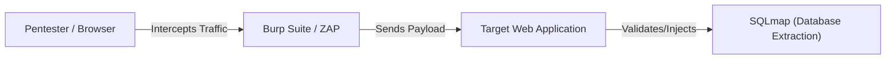

# Awesome Ethical Hacking Tools

  
  
  
  

A curated, comprehensive directory of awesome tools for ethical hacking, penetration testing, and security auditing. The tools are organized by the phase of standard penetration testing methodology.

> [!NOTE]
> Looking for guided learning roadmaps, video courses, books, and wargames? Check out our curated list: **[Awesome Hacking Tutorials & Resources](tutorials-and-resources.md)**!

> [!WARNING]
> **Disclaimer:** This repository and the tools listed herein are intended solely for educational, research, and authorized security testing. Running these tools against networks, systems, or web applications without explicit written permission from the owner is strictly prohibited and illegal.

---

## Table of Contents

* [1. Information Gathering & Reconnaissance (OSINT)](#1-information-gathering--reconnaissance-osint)
* [2. Scanning & Vulnerability Analysis](#2-scanning--vulnerability-analysis)
* [3. Web Application Security](#3-web-application-security)
* [4. Exploitation Frameworks](#4-exploitation-frameworks)
* [5. Post-Exploitation & Privilege Escalation](#5-post-exploitation--privilege-escalation)
* [6. Wireless Hacking](#6-wireless-hacking)
* [7. Password Hacking & Cryptography](#7-password-hacking--cryptography)
* [8. Reverse Engineering & Malware Analysis](#8-reverse-engineering--malware-analysis)
* [9. Premium Hacking OS / Distributions](#9-premium-hacking-os--distributions)
* [10. Quick-Reference Tools Matrix](#10-quick-reference-tools-matrix)
* [11. Contribution Guidelines](#11-contribution-guidelines)

---

## 1. Information Gathering & Reconnaissance (OSINT)

Reconnaissance is the most critical phase of penetration testing. These tools help collect public records, active domains, open directories, and target profiles.

*   **[nmap](https://nmap.org/)** - The industry standard for network discovery and vulnerability scanning.
*   **[theHarvester](https://github.com/laramies/theHarvester)** - Gather emails, subdomains, hosts, employee names, open ports, and banners from public sources (Google, Bing, LinkedIn, etc.).
*   **[Shodan](https://www.shodan.io/)** - A search engine for internet-connected devices. Useful for locating exposed databases, routers, and IoT hardware.
*   **[Maltego](https://www.maltego.com/)** - An interactive data mining tool that visualizes links between domains, IP addresses, companies, and individuals.
*   **[Spiderfoot](https://github.com/smicallef/spiderfoot)** - An OSINT automation tool that queries over 100 public data sources to gather intelligence on IPs, domain names, and emails.
*   **[Sublist3r](https://github.com/aboul3la/Sublist3r)** - Fast subdomain enumerator designed to search popular search engines and DNS repositories.

---

## 2. Scanning & Vulnerability Analysis

Once targets are identified, these tools scan for open ports, misconfigurations, and known CVEs.

*   **[Nessus](https://www.tenable.com/products/nessus)** - A commercial, highly polished vulnerability assessment tool for networks, cloud configurations, and systems.
*   **[OpenVAS / Greenbone](https://www.openvas.org/)** - A full-featured, open-source vulnerability scanner with daily feed updates.
*   **[Nikto](https://github.com/sullo/nikto)** - An open-source web server scanner that performs rapid tests against servers for multiple items, including over 6700 potentially dangerous files/programs.
*   **[Nuclei](https://github.com/projectdiscovery/nuclei)** - Fast and customizable vulnerability scanner based on simple YAML-based templates. Very popular in modern bug hunting.

---

## 3. Web Application Security

Websites are the most common entry point for attackers. These tools intercept and analyze web traffic, scan for injections, and map hidden endpoints.

*   **[Burp Suite](https://portswigger.net/burp)** - The gold-standard web proxy for intercepting, modifying, and analyzing HTTP traffic between the browser and target server.
*   **[OWASP ZAP](https://www.zaproxy.org/)** - The most popular open-source alternative to Burp Suite, offering proxying, spidering, and vulnerability scanning.
*   **[sqlmap](https://sqlmap.org/)** - An open-source tool that automates the process of detecting and exploiting SQL injection flaws and taking over database servers.
*   **[Gobuster](https://github.com/OJ/gobuster)** - A fast directory/file, DNS, and vhost busting tool written in Go.
*   **[Wfuzz](https://github.com/xmendez/wfuzz)** - Extremely flexible web fuzzer designed for bruteforcing GET/POST parameters, headers, and paths.

---

## 4. Exploitation Frameworks

After identifying vulnerabilities, these platforms run payloads and deliver shell access to the target systems.

*   **[Metasploit Framework](https://www.metasploit.com/)** - The most widely used penetration testing platform. It contains database tracking, exploit modules, payloads, and post-exploitation scripts.
*   **[Beef](https://github.com/beefproject/beef)** - (Browser Exploitation Framework) Focuses on client-side attacks against web browsers to run scripts, bypass security controls, and pivot.
*   **[ExploitDB](https://www.exploit-db.com/)** - An archive of public exploits and shellcode for various software versions, managed by Offensive Security.

---

## 5. Post-Exploitation & Privilege Escalation

After getting inside a machine, these scripts identify configuration issues to elevate low-privilege users to Root or System Administrator.

*   **[Mimikatz](https://github.com/gentilkiwi/mimikatz)** - A powerful Windows post-exploitation tool that extracts plain text passwords, hash dumps, PINs, and Kerberos tickets from memory (LSASS).
*   **[PEASS-ng (LinPEAS / WinPEAS)](https://github.com/carlospolop/PEASS-ng)** - Essential scripts for checking privilege escalation paths on Linux and Windows machines.
*   **[BloodHound](https://github.com/BloodHoundAD/BloodHound)** - A single-page Javascript web application that uses graph theory to reveal hidden and unintended relationships in Active Directory environments.
*   **[Impacket](https://github.com/fortra/impacket)** - A collection of Python classes for working with network protocols (SMB, MSRPC, LDAP). Essential for lateral movement in Windows networks.

---

## 6. Wireless Hacking

Auditing wireless security configurations (Wi-Fi, Bluetooth, RFID).

*   **[Aircrack-ng](https://www.aircrack-ng.org/)** - A complete suite of tools to assess WiFi network security. Includes monitoring, attacking, testing, and cracking tools.
*   **[Kismet](https://www.kismetwireless.net/)** - A wireless network and device detector, sniffer, wardriving tool, and WIDS (Wireless Intrusion Detection System).
*   **[Wifite2](https://github.com/derv82/wifite2)** - A Python script to automate wireless auditing of WEP, WPA-PSK, and WPS encrypted networks.

---

## 7. Password Hacking & Cryptography

Tools for bruteforcing logins and cracking password hashes.

*   **[Hashcat](https://hashcat.net/hashcat/)** - The world's fastest CPU/GPU-based password recovery utility. Supports hundreds of hashing algorithms.
*   **[John the Ripper](https://www.openwall.com/john/)** - A highly customizable, fast password cracker for Unix, Windows, and macOS, supporting dictionary attacks and rules.
*   **[Hydra](https://github.com/vanhauser-thc/thc-hydra)** - A very fast network logon cracker which supports numerous protocols including SSH, RDP, FTP, HTTP-POST, and Telnet.

---

## 8. Reverse Engineering & Malware Analysis

Disassembling binaries to discover vulnerabilities, bypass registration gates, and analyze malware behavior.

*   **[Ghidra](https://ghidra-sre.org/)** - A software reverse engineering (SRE) suite created and maintained by the National Security Agency (NSA). Includes a decompiler.
*   **[IDA Pro](https://hex-rays.com/ida-pro/)** - The industry-standard commercial disassembler and debugger, widely praised for its graph layout and plugin ecosystem.
*   **[Radare2](https://www.radare.org/)** - A complete command-line-based framework for reverse-engineering, debugging, and binary patching.
*   **[x64dbg](https://x64dbg.com/)** - An open-source x64/x32 debugger for Windows, geared towards malware analysis and software cracking.

---

## 9. Premium Hacking OS / Distributions

Operating systems that come pre-packaged with all the ethical hacking tools mentioned above.

*   **[Kali Linux](https://www.kali.org/)** - The most popular Debian-based Linux distribution geared toward information security professionals and penetration testers.
*   **[Parrot Security OS](https://www.parrotsec.org/)** - A lightweight, privacy-focused Linux distribution designed for security experts, developers, and sysadmins.
*   **[BlackArch Linux](https://blackarch.org/)** - An Arch Linux-based distribution containing over 2800 security tools for advanced penetration testing.

---

## 10. Quick-Reference Tools Matrix

| Tool | Category | License | Platform Support | Primary Purpose |
| :--- | :--- | :--- | :--- | :--- |
| **Nmap** | Scanning | Open Source | Linux, Win, macOS | Port scanning and OS fingerprinting |
| **Burp Suite** | Web Security | Free / Commercial | Linux, Win, macOS | HTTP interception proxy & vulnerability scanner |
| **Metasploit** | Exploitation | Open Source / Comm | Linux, Win, macOS | Exploit execution and payload management |
| **Hashcat** | Password | Open Source | Linux, Win, macOS | GPU-accelerated hash cracking |
| **Ghidra** | Rev. Engineering | Open Source | Linux, Win, macOS | Binary disassembling and decompilation |
| **LinPEAS** | Post-Exploit | Open Source | Linux | Privilege escalation scanning |
| **BloodHound** | AD Security | Open Source | Linux, Win, macOS | Map Active Directory attack paths |

---

## 11. Contribution Guidelines

Have a tool that deserves to be on this list?
1. Check that the tool is active, open-source (or has a widely used free tier), and not deprecated.
2. Fork the repository and add the tool under the appropriate category.
3. Create a Pull Request with details about what the tool does and why it is awesome!