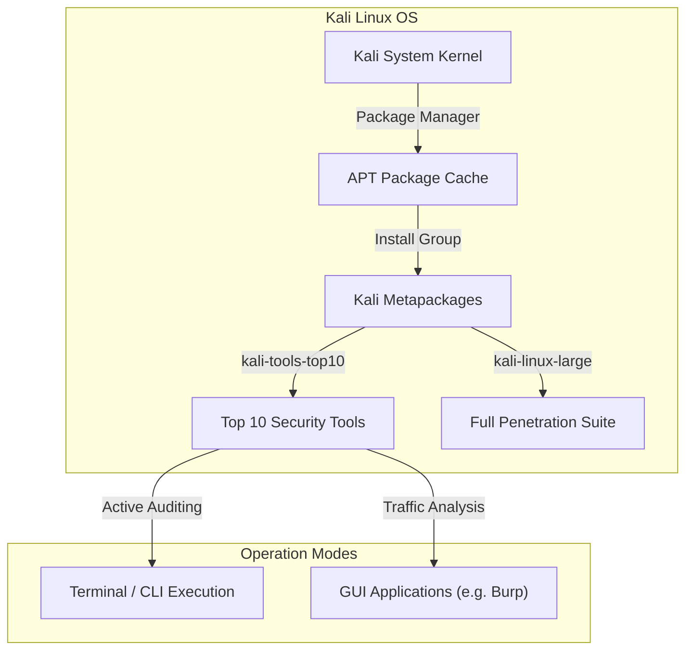

# Guide: Kali Linux Mastery & Tool Guidance

A deep, hands-on learning roadmap for configuring, updating, and executing tools inside Kali Linux, the industry-standard security operating system.

---

## Lab Network & System Setup



---

## 1. Kali Linux Package Management & Updates

Kali Linux is a rolling distribution based on Debian Testing. Maintaining package databases is crucial for stability.

### A. Updating System Packages
Always update your package lists and upgrade existing software before launching assessments.
```bash
sudo apt update && sudo apt full-upgrade -y
```
*Note: `full-upgrade` is preferred over `upgrade` as it handles dependencies changes between releases.*

### B. Cleaning Up Package Cache
Reduce disk space utilization after major upgrades:
```bash
sudo apt autoremove -y && sudo apt clean
```

---

## 2. Working with Kali Metapackages

Metapackages allow you to install curated groups of tools depending on your storage limits and testing scope.

*   **kali-tools-top10:** Installs the ten most popular security tools (aircrack-ng, burpsuite, john, maltego, nmap, owasp-zap, sqlmap, thc-hydra, wireshark, metasploit).
    ```bash
    sudo apt install kali-tools-top10 -y
    ```
*   **kali-linux-default:** The standard tools included in the default Kali ISO image (approx. 3-4 GB).
    ```bash
    sudo apt install kali-linux-default -y
    ```
*   **kali-linux-large:** Installs a much wider range of tools for multiple pentesting domains (approx. 8-10 GB).
    ```bash
    sudo apt install kali-linux-large -y
    ```
*   **kali-tools-wireless:** Installs all tools related to Wi-Fi, Bluetooth, and RFID auditing.
    ```bash
    sudo apt install kali-tools-wireless -y
    ```

---

## 3. Essential Kali Configuration Commands

*   **Change Default Keymap (e.g., to US keyboard):**
    ```bash
    sudo setxkbmap us
    ```
*   **Configure SSH Server (Disabled by default for security):**
    ```bash
    # 1. Enable and start SSH service
    sudo systemctl enable ssh --now
    
    # 2. Check service status
    sudo systemctl status ssh
    ```
*   **Locating Files & Exploit Code:**
    Kali contains a local copy of Exploit-DB exploits. Use `searchsploit` to locate them:
    ```bash
    searchsploit windows local bypass bypassuac
    ```
    *Search for exploits offline without connecting to the internet.*

---

## 4. Troubleshooting Network & Services

*   **Check Active Network Connections:**
    ```bash
    ss -antp
    ```
*   **Manage System Services (Start / Stop / Restart):**
    ```bash
    sudo systemctl restart NetworkManager
    ```
*   **Change MAC Address (For anonymity on wireless/wired networks):**
    ```bash
    # 1. Bring interface down
    sudo ip link set eth0 down
    
    # 2. Spoof MAC using macchanger
    sudo macchanger -r eth0
    
    # 3. Bring interface back up
    sudo ip link set eth0 up
    ```

---

## 5. Disclaimer

> [!WARNING]
> Only execute packet capturing or network scanning services on systems under your immediate authority. Unauthorized monitoring of network traffic can violate local laws.
